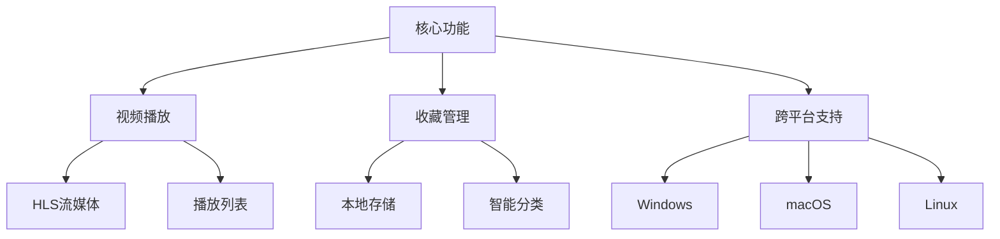
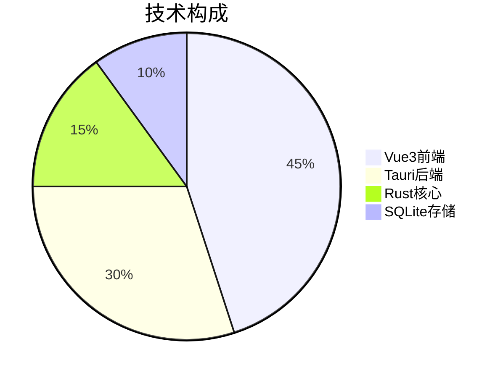
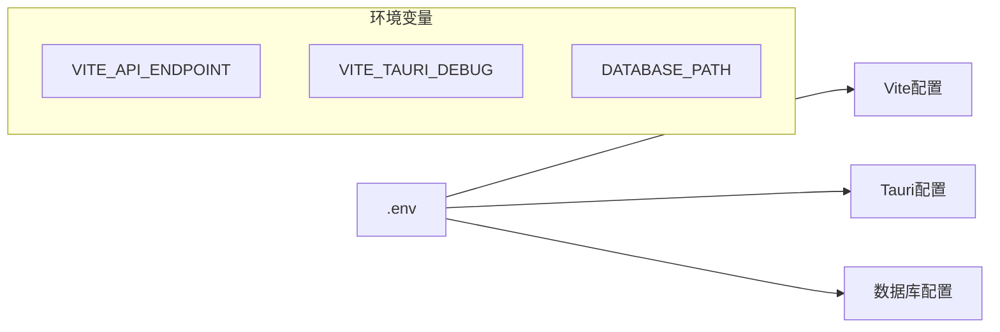

# A-VIDEO 跨平台视频应用


[](https://vuejs.org/)
[](https://tauri.app/)
[](https://sqlite.org)



## 技术栈架构



## 快速开始

### 环境要求
- Node.js 18+
- Rust 1.70+
- pnpm 8+

### 安装步骤
```bash
# 前端依赖
pnpm install

# Tauri构建环境
pnpm tauri init
```

### 开发模式
```bash
# 启动开发服务器
pnpm dev

# 运行桌面应用
pnpm tauri dev
```

## 项目配置


## 贡献指南

1. Fork项目仓库
2. 创建特性分支 (`git checkout -b feature/新功能`)
3. 提交更改 (`git commit -m '添加新功能'`)
4. 推送分支 (`git push origin feature/新功能`)
5. 创建Pull Request

## 许可证
MIT License - 详见 [LICENSE](LICENSE)

---

> 项目文档持续更新中，最新技术细节请参考 [API文档](src/API.txt)
